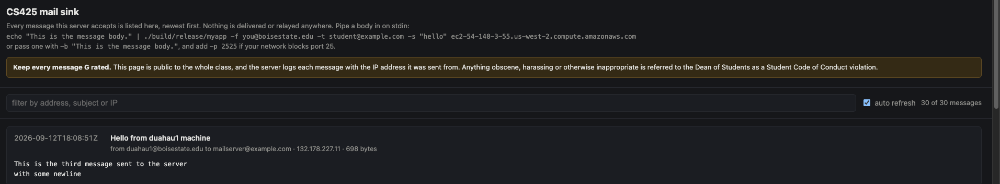
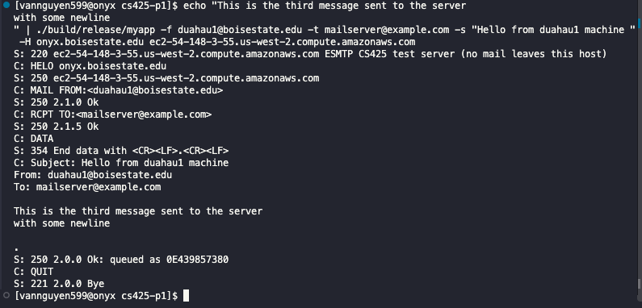

# Project 1: Simple SMTP Client

- Name: Van Nguyen
- Email: vannguyen599@u.boisestate.edu
- Class: CS525

## Known Bugs or Issues

There are no issues that I have known of. Email have been sent as expected as below

And in the terminal the following response has been printed out


No crash and memory leaks have been found with test coverage for `lab.h` is 100%.

## Experience

In this project I have struggle quite a bit as I am not very used to writing C and it took me far more time to refresh my memories with the C syntax then to write actual code. Testing was also the part where it took a lot of time as I have to go back and forth changing the code in `client.c` to make sure my functions are testable. Mocking and stubbing in Unity was not very easy for me and this was one of the part where AI helped a lot. It helped me to create a mock socket and how to define it. I was trying to run `make report` and encountered the following error
```gcovr -r . --html --html-details --exclude-directories build/tests/harness --exclude '.*main\.c$' --exclude '.*test\.c$' -o ./build/report/html/coverage_report.html /bin/bash: line 1: gcovr: command not found```
I tried to sudo install it but it requires admin access so I install `gcovr` on my machine and ran the report. 